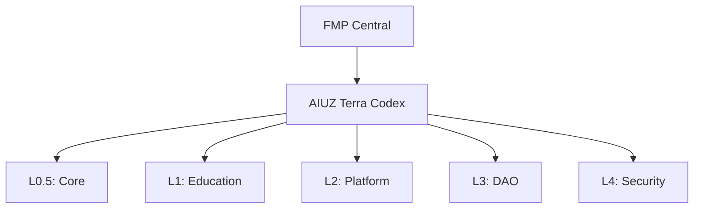

[](https://github.com/AIUZ-Terra-Codex-EcoSystem/terra-legal)
[](https://github.com/AIUZ-Terra-Codex-EcoSystem/terra-legal/blob/main/CODE_OF_CONDUCT.md)

# 🌐 AIUZ TERRA CODEX
> Complete ecosystem archive: Education • Solar EV • DAO • Knowledge Tokenization

[](https://creativecommons.org/publicdomain/zero/1.0/)
[](https://orcid.org/0009-0000-6394-4912)
[](https://doi.org/10.5281/zenodo.18860222)

**Part of the [Fractal Metascience Paradigm (FMP)](https://github.com/Secret-Uzbek/FMP-CENTRAL-REPO) ecosystem.**

## 🗂️ Оглавление
1. [О проекте](#-о-проекте)
2. [Архитектура](#-архитектура)
3. [Модули](#-модули)
4. [Быстрый старт](#-быстрый-старт)
5. [Цитирование](#-цитирование)
6. [Лицензия](#-лицензия)

## 🌍 О проекте
**AIUZ Terra Codex** — суверенная образовательная экосистема на базе FMP.

| Компонент | Описание | Статус |
|-----------|----------|--------|
| 🧬 TerraMemoryDNA | Контекстная память с семантическим сжатием | ✅ v4.5 |
| 🎓 AI Education Module | Персонализированное обучение (0-18+) | 🔄 В разработке |
| 🏛️ DAO Governance | Репутационное управление (БЕЗ токенов) | ✅ Spec v1.0 |
| 🔐 Child Safety First | Этическое вето на все решения | ✅ Принудительно |

## 🏗️ Архитектура


## 📦 Модули
| Файл | Описание |
|------|----------|
| [1.system-core.md](./1.system-core.md) | Ядро: TerraQuark, NanoCore, MicroCore |
| [2.learning-knowledge.md](./2.learning-knowledge.md) | Образовательный модуль |
| [3.user-interfaces.md](./3.user-interfaces.md) | Интерфейсы: мультиязычные, безопасные |
| [4.dao-governance.md](./4.dao-governance.md) | DAO на репутации: без токенов |
| [5.knowledge-tokenization.md](./5.knowledge-tokenization.md) | Токенизация знаний |
| [6.global-knowledge-db.md](./6.global-knowledge-db.md) | Глобальная БД знаний |

## 🚀 Быстрый старт
```bash
git clone https://github.com/Secret-Uzbek/AIUZ-Terra-codex.git
cd AIUZ-Terra-codex
python3 -m http.server 8000
```

## 📜 Цитирование
```bibtex
@software{abdukarimov_aiuz_terra_codex_2026,
  author = {Abdukarimov, Abdurashid},
  title = {{AIUZ Terra Codex}},
  year = {2026},
  doi = {10.5281/zenodo.18860222},
  license = {CC0-1.0}
}
```

## ⚖️ Лицензия
**CC0 1.0 Universal** — общественное достояние.

📧 a.abdukarimov@fractal-metascience.org | 📍 Tashkent, Uzbekistan 🇺🇿

---
## 🌍 FMP Ecosystem Links
| Repo | Layer | Role |
|---|---|---|
| [FMP-CENTRAL-REPO](https://github.com/Secret-Uzbek/FMP-CENTRAL-REPO) | L7 | Core Hub |
| [AIUZ-Terra-codex](https://github.com/Secret-Uzbek/AIUZ-Terra-codex) | L6 | Ecosystem |
| [AIUZ-terra-codex-FMP](https://github.com/Secret-Uzbek/AIUZ-terra-codex-FMP) | L5 | Education |
| [terra-translation-api](https://github.com/Secret-Uzbek/terra-translation-api) | L4 | PLT API |

*Generated by Terra GitHub Helper · NULLO Protocol*
